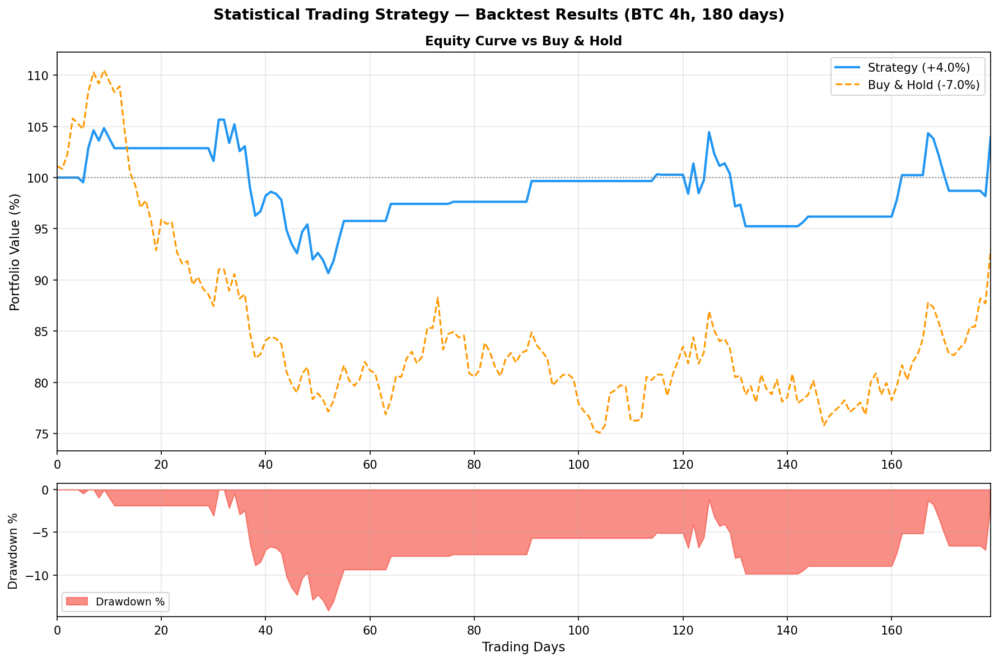

# Quantitative Backtesting Engine


A rule-based quantitative trading signal system for digital asset markets — **no machine learning, no black-box decisions**. Every signal is fully explainable from first principles: 4 classical technical setups vote independently, and the result is aggregated into a confidence score.

Includes a vectorized backtesting engine, a real-time multi-asset scanner (50+ symbols), a parameter sweep optimizer, and a risk/edge calculator with per-symbol configuration.

---

## Verified Backtest Results

> All figures include **0.1% commission + 0.05% slippage** per round trip. Data: Binance public OHLCV.

| Configuration | Timeframe | Annual Return | Win Rate | Profit Factor | Max Drawdown | Trades/year |
|---|---|---|---|---|---|---|
| Conservative preset | 1d | **+24.26%** | 52.83% | **1.92** | ~7% | ~55 |
| Balanced preset | 12h | **~+28%** | 50.98% | 1.72 | ~8% | ~100 |

**Top symbols (1d balanced, 365-day backtest):**

| Symbol | Backtest Return | Win Rate |
|---|---|---|
| DOGEUSDT | +1,516% | 83.3% |
| DOTUSDT | +672% | 66.7% |
| BTCUSDT | +394% | 53.8% |
| XRPUSDT | +126% | 50.0% |

---

## Results Preview

The backtesting engine outputs a full equity curve compared to passive buy-and-hold, along with a drawdown panel. The chart below shows a BTC 4h strategy run over 180 days — the rule-based system preserves capital during the bearish period while buy-and-hold dropped ~7%.



---

## Overview

| Component | File | Description |
|-----------|------|-------------|
| **Scanner** | `run_statistical_scanner.py` | Scans N symbols for live signals; one-shot or continuous mode with Telegram alerts |
| **Backtest** | `run_statistical_backtest.py` | Vectorized historical backtest on OHLCV data; single-asset or multi-asset portfolio mode |
| **Param sweep** | `run_statistical_param_sweep.py` | Grid search over TP/SL multipliers, ADX filters, time-exit combos; outputs ranked table |
| **Launcher** | `LaunchStatisticalSystem.py` | Convenience wrapper; exposes named strategy presets via CLI |
| **Package** | `statistical_system/` | Core library: signal generator, backtest engine, multi-asset scanner, signal ranker, config |

---

## Trading Setups

The signal generator implements 4 independent rule-based setups:

| Setup | Logic |
|-------|-------|
| **Breakout** | Close above BB upper / below BB lower with volume spike (≥1.5× 20-period average) and a confirmed directional candle |
| **Pullback** | EMA-50 / EMA-200 trend confirmed; RSI has pulled back to oversold/overbought zone |
| **Mean Reversion** | Price at BB±2σ boundary; RSI at extremes (≤30 or ≥70); fades overextended moves |
| **Volatility Expansion** | ATR in bottom 20th percentile (BB squeeze); catches the initial expansion burst |

Signals are scored by a **weighted composite** of confidence, risk/reward ratio, number of confirming setups, and asset quality — the top signals are selected for each scan cycle.

---

## Quick Start

### 1. Install
```bash
pip install -r requirements.txt
```

### 2. Configure environment (for Telegram alerts)
```bash
cp .env.example .env
# Edit .env and fill in TELEGRAM_BOT_TOKEN and TELEGRAM_CHAT_ID
```

### 3. Scan for signals (one-shot)
```bash
python run_statistical_scanner.py --preset balanced
```

### 4. Run a historical backtest
```bash
python run_statistical_backtest.py --symbol BTCUSDT --days 365 --timeframe 1d --preset balanced
```

### 5. Multi-asset portfolio backtest
```bash
python run_statistical_backtest.py --mode multi --days 180 --timeframe 12h --preset balanced
```

### 6. Parameter sweep
```bash
python run_statistical_param_sweep.py --symbol BTCUSDT --days 365 --timeframe 1d
```

### 7. Continuous live scanning with Telegram
```bash
python run_statistical_scanner.py --mode continuous --telegram --interval 30
```

---

## Strategy Presets

Three built-in presets balance signal frequency vs. quality:

| Preset | Timeframe | Signal frequency | Use case |
|--------|-----------|-----------------|----------|
| `conservative` | 1d | Low — high quality only | Long-term portfolio |
| `balanced` | 4h / 12h | Medium | Default recommended |
| `aggressive` | 12h / 1h | High | Active short-term |

---

## Project Structure

```
├── run_statistical_scanner.py      # Main scanner entry point (live signals)
├── run_statistical_backtest.py     # Historical backtest runner
├── run_statistical_param_sweep.py  # Strategy parameter grid search
├── LaunchStatisticalSystem.py      # Convenience launcher with named presets
├── telegram_sender.py              # Telegram notification helper
├── risk_metrics.py                 # Risk/EV calculations (RRR, edge, EV)
├── risk_config.json                # Per-symbol risk parameters and thresholds
└── statistical_system/             # Core library package
    ├── config.py                   # SignalConfig, BacktestConfig, preset factory
    ├── signal_generator.py         # 4 trading setups → Signal dataclass
    ├── backtest_engine.py          # Vectorized backtester with equity curve + Trade list
    ├── multi_asset_scanner.py      # Parallel symbol scanning + Telegram integration
    ├── signal_ranker.py            # Composite signal scoring and ranking
    ├── README.md                   # Detailed system documentation
    ├── CHEATSHEET.md               # Quick command reference
    ├── QUICK_START.md              # 5-minute getting started guide
    ├── IMPLEMENTATION_SUMMARY.md   # Architecture decisions and roadmap
    └── INDEX.md                    # File index
```

---

## Backtest Engine Features

- **Vectorized execution** on pandas DataFrames — fast on years of history
- **Realistic costs**: 0.1% commission + 0.05% slippage per round trip (configurable)
- **Exit types**: TP hit, SL hit, time-based exit (max candles)
- **Metrics**: profit factor, max drawdown, Sharpe ratio, win rate, average RRR, equity curve
- **Output**: JSON summary + CSV trade log + console report

---

## Environment Variables

| Variable | Required | Description |
|----------|----------|-------------|
| `TELEGRAM_BOT_TOKEN` | Only with `--telegram` | Telegram bot API token |
| `TELEGRAM_CHAT_ID` | Only with `--telegram` | Telegram chat / channel ID |
| `BINANCE_API_KEY` | No | Binance API key (public OHLCV works without it) |
| `BINANCE_API_SECRET` | No | Binance API secret |

Copy `.env.example` to `.env` and fill in your values. **Never commit `.env` to version control.**

---

## Tech Stack

- **pandas / numpy** — vectorized OHLCV processing and backtesting
- **ta** — technical analysis indicators (RSI, MACD, Bollinger Bands, ATR, ADX)
- **ccxt** — Binance OHLCV data fetching
- **python-dotenv** — environment variable management
- **requests** — Telegram Bot API calls
